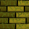

# Zombie-game BY Supisara
## Player :sunglasses:

### Story

ชายผู้ที่กำลังติดเชื้อ เขาต้องการ <em><strong>ยาต้านเชื้อ zombie :syringe:</strong><em> 
เพื่อที่จะทำให้เขาเยื้อชีวิตตัวเองจาการกลายเป็น <em><strong>ซอมบี้ :zombie:</strong><em> 
แน่นอนว่าการต้องไปตามหายาในโลกที่กำลังมีเชื้อแพร่ระบาด เขาต้องเผชิญกับ <strong>ZOMBIEEEEE!!! แฮร่~~~</strong>

### Control :
<h4>
UP(↑)  
DOWN(↓)  
LEFT(←)  
RIGHT(→)  
</h4>

## Zombie :zombie_man:

### Story

ผู้ที่กำลังติดเชื้อ และพวกเขาเป็นซอมบี้ไปแล้ว พวกเขาต้องการ <em><strong>กินเนื้อของมนุษย์ :cut_of_meat: แบบไม่สุก(ดิบ)</strong><em> 
การดำรงอยู่ของพวกเขามีเพื่อเป็น <em><strong>ศรัตรู!! :imp:</strong><em> เพื่อรอวันล้างบางมนุษยชาติจนหมดสิ้น~~ 

### Movement :
<h4>
ต้องยอมรับว่าการเคลื่อนที่ของพวกมันเราไม่สามารถคาดการณ์อะไรได้เลย(Random):man_dancing: 
<em><strong>ต้องระวังทุกไก่ย่าง</strong><em> ผ่ามมม!!
</h4>

## Wall :bricks:

### Story

สิ่งกีดขวาง แน่นอนว่า<em><strong> มันขวางเราไว้!!! :no_entry_sign:</strong><em>

### Movement :
<h4>
<em><strong>มันขยับไม่ได้</strong><em> ผ่ามมม!!
</h4>

## Medicine :syringe:

### Story

ยาต้านเชื้อ แน่นอนว่า<em><strong> มันต้านโรคร้ายได้ :no_entry_sign:</strong><em>

### Movement :
<h4>
<em><strong>มันขยับไม่ได้</strong><em> ผ่ามมม!!
</h4>

<h1>ช่วยโลกใบนี้ไว้!!</h1>
